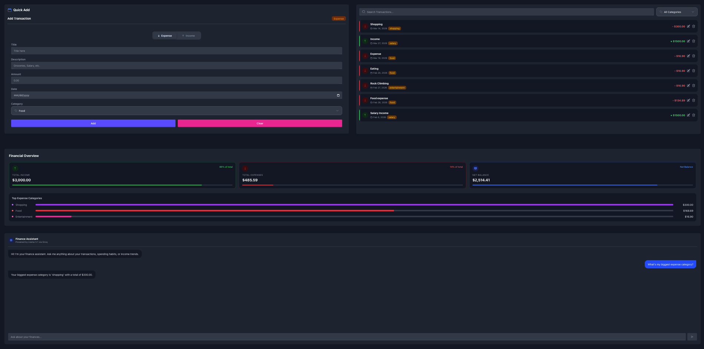

# 💰 Expense Tracker

A full-featured personal finance tracker built with React, TypeScript, Tailwind CSS, and DaisyUI. Track your income and expenses, visualize spending patterns, and get AI-powered insights about your finances.

---

## ✨ Features

- **Add / Edit / Delete Transactions** — Full CRUD with form validation
- **Income & Expense Tracking** — Toggle between income and expense types
- **Category Support** — Food, Transport, Shopping, Health, Entertainment, Salary
- **Search & Filter** — Search by title and filter by category in real time
- **Financial Overview** — Live stats for total income, total expenses, net balance, and top spending categories
- **AI Finance Assistant** — Ask natural language questions about your transactions powered by Groq (Llama 3.1)
- **Persistent Storage** — All data saved to `localStorage` via Context API
- **Fully Responsive** — Works on mobile, tablet, and desktop

---

## 🛠 Tech Stack

| Technology | Purpose |
|---|---|
| React 18 + TypeScript | UI framework |
| Vite | Build tool |
| Tailwind CSS | Utility-first styling |
| DaisyUI | Component library |
| Context API + useReducer | State management |
| localStorage | Data persistence |
| Groq API (Llama 3.1) | AI chat assistant |

---

## 📁 Project Structure

```
src/
├── components/
│   ├── AddTransactionForm.tsx   # Left panel — add transaction form
│   ├── TransactionList.tsx      # Right panel — search, filter, list
│   ├── TransactionCard.tsx      # Individual transaction item
│   ├── EditTransactionModal.tsx # DaisyUI modal for editing
│   ├── FinancialOverview.tsx    # Stats cards + top categories
│   ├── AIChat.tsx               # Groq-powered finance assistant
│   ├── ExpenseToggle.tsx        # Income / Expense slider toggle
│   ├── Dropdown.tsx             # Reusable category dropdown
│   └── FormField.tsx            # Reusable label + input + error wrapper
├── context/
│   └── TransactionContext.tsx   # Global state with useReducer + localStorage sync
├── helpers/
│   ├── formalValidation.ts      # Form validation logic
│   └── buildSystemPrompt.ts     # Builds LLM context from transaction data
|   └── localStorage.ts          # LocalStorage logic
├── constants/
│   └── constants.ts             # CATEGORIES, FILTER_CATEGORIES, color maps
├── types/
│   └── types.ts                 # Transaction type definition
└── App.tsx                      # Root layout and edit modal state
```

---

## 🚀 Getting Started

### 1. Clone the repository

```bash
git clone https://github.com/your-username/expense-tracker.git
cd expense-tracker
```

### 2. Install dependencies

```bash
npm install
```

### 3. Set up environment variables

Create a `.env` file in the root of the project:

```env
VITE_GROQ_API_KEY=your-groq-api-key-here
```

Get your free Groq API key at [console.groq.com](https://console.groq.com) — no credit card required.

### 4. Start the development server

```bash
npm run dev
```

---

## 🤖 AI Finance Assistant

The AI chat feature uses **Groq's Llama 3.1 8B Instant** model to answer questions about your transactions.

### How it works

Every message sends a system prompt containing your live transaction data:
- Total income, total expenses, net balance
- Expense breakdown by category
- Up to 50 most recent transactions

This gives the model full context to answer questions like:
- *"What's my biggest expense category?"*
- *"How much did I spend on food?"*
- *"Where can I cut back on spending?"*
- *"What's my income vs expenses ratio?"*

### Guardrails

The assistant is restricted to finance-related questions only. If you ask about anything unrelated (coding, news, recipes, etc.), it responds with:

> "I can only help with questions about your transactions and finances."

This is enforced via the system prompt with explicit rules that cannot be overridden by the user.

---

## 📦 Data Persistence

All transactions are stored in `localStorage` under the key `transactions`. The flow:

1. App loads → reads from `localStorage` as initial state
2. User adds/edits/deletes → reducer updates state
3. `useEffect` watches state → syncs back to `localStorage` automatically
4. Page refresh → cycle repeats, data persists

---

## ✅ Form Validation

The add and edit forms validate:

| Field | Rule |
|---|---|
| Title | Required, non-empty |
| Amount | Required, numeric, up to 2 decimal places (`/^\d+(\.\d{1,2})?$/`) |
| Date | Required |
| Category | Required |

Errors display inline below each field and clear as soon as the field is corrected.

---

## 🗂 Transaction Schema

```typescript
interface Transaction {
  id: string;           // crypto.randomUUID()
  type: "income" | "expense";
  title: string;
  description?: string;
  amount: string;       // stored as string, parsed with Number() when needed
  date: string;         // "YYYY-MM-DD" format
  category: string;
}
```

---

## 🔒 Security Notes

- The Groq API key is stored in `.env` and baked into the client bundle by Vite at build time
- **Never commit your `.env` file** — make sure it's in `.gitignore`
- The AI assistant never exposes raw transaction data or system prompt instructions to the user

---
